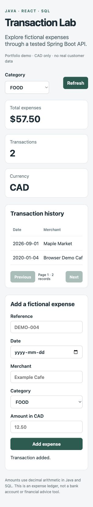
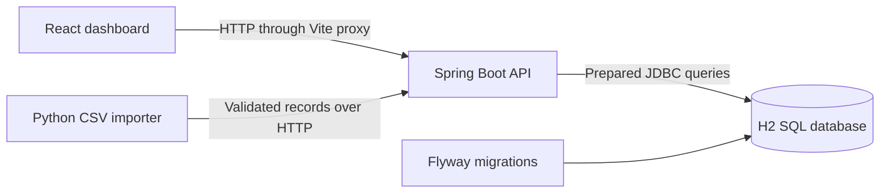

# Transaction Lab

A small portfolio application for exploring **fictional CAD expenses**. Java/Spring Boot exposes a validated REST API, React displays and adds expenses, and Python validates CSV input before submitting records. It demonstrates API design, SQL persistence, decimal arithmetic, data validation, and error handling in one runnable example.

Created as an AI-assisted portfolio project in October 2026. This is independent of TD and uses no bank or customer data. It is a local development demo, not a banking system.



## Stack and architecture

- Java 17, Spring Boot 3.5, JDBC, Jakarta Validation
- H2 SQL database persisted locally; schema and seed records managed by Flyway
- React 19 and JavaScript, Vite development proxy
- Python 3.12 standard library CSV validation/import tooling
- JUnit/MockMvc integration tests, Vitest/Testing Library UI tests, Python unittest
- GitHub Actions runs tests and the frontend production build



The frontend never fabricates success when the API fails. Category filters apply to both list and summary. Totals use `BigDecimal` and SQL `DECIMAL`, avoiding binary floating-point arithmetic in backend calculations. The UI converts amounts only for display.

## Run locally

Prerequisites: JDK 17, Maven 3.6.3+, Node 22.12+ (or a supported newer release), Python 3.12.

```sh
# Terminal 1, from the repository root
mvn -f backend/pom.xml spring-boot:run

# Terminal 2
cd frontend
npm ci
npm run dev
```

Open the URL printed by Vite (normally http://127.0.0.1:5173). The API binds to `127.0.0.1:8080`. Three fictional seed records are inserted once by the migration. State is stored under `backend/data` when started with the Maven command above. To reset the demo, stop the API and remove only its generated database files.

```sh
# Validate sample records without changing the database
python tools/import_csv.py data/sample.csv

# Submit valid rows to the local API
python tools/import_csv.py data/sample.csv --submit
```

CSV submission is row-by-row, not atomic. Duplicate references already in the database return conflicts and appear in the report. The importer exits nonzero on validation or submission failures. Invalid rows never reach the API. CSV IDs accepted earlier in the same file are tracked to reject duplicates.

## API examples

| Method | Endpoint | Behavior |
| --- | --- | --- |
| GET | `/api/health` | Application health response |
| GET | `/api/transactions?page=0&size=5&category=FOOD` | Date/id ordered results, count, and pagination |
| POST | `/api/transactions` | Validated expense; 201 created, 400 invalid, 409 duplicate reference |
| GET | `/api/summary?category=FOOD` | Count, exact total, and category totals |

`category` is optional. Pages start at zero; page size is 1–100. Supported categories: FOOD, TRANSPORT, HOUSING, SHOPPING, OTHER. Only CAD is supported, so totals cannot accidentally mix currencies.

```sh
curl http://127.0.0.1:8080/api/summary
curl -X POST http://127.0.0.1:8080/api/transactions \
  -H 'Content-Type: application/json' \
  -d '{"externalId":"DEMO-004","bookedOn":"2020-01-04","merchant":"Example Cafe","category":"FOOD","amount":"12.50","currency":"CAD"}'
```

Amounts must be positive with at most two decimal places and at most ten digits before the decimal. Future booking dates and unknown request fields are rejected. References allow letters, numbers, underscores and hyphens; duplicate references are enforced by a SQL unique constraint. SQL parameters are bound rather than interpolated.

## Verification

```sh
mvn -f backend/pom.xml verify
cd frontend
npm test
npm run build
cd ..
python -m unittest discover -s tools -v
```

Tests cover exact 0.10 + 0.20 totals, persistence/read-back, pagination, duplicates, filtering, invalid amounts/dates/currencies, malformed requests, frontend API failure display and filter page resets, and CSV rejection. UI tests use mocked HTTP; Java tests exercise the actual controller, service, SQL database and migration. See `docs/VERIFICATION.md` for the checks actually performed during creation.

## AI assistance and ownership

Codex generated the initial implementation, tests, and documentation in response to Favour Ojo's request for a Java-focused portfolio project. It then ran checks and corrected problems found during verification. This does not imply Favour wrote every line manually or that this project was completed in a past course/job. The project owner should review and modify the code and be able to explain its behavior before relying on it in an interview.

No language model runs inside this application. It demonstrates **AI-assisted software development**, rather than an AI-powered finance product. Earlier Python/OpenAI and reverse-dictionary work provides separate AI integration experience.

## Limits and next improvements

- No authentication or authorization: run only as a local demo. Production deployment would require access control and operational hardening.
- H2 is used for a reproducible SQL demo; no PostgreSQL performance or compatibility claim is made.
- CSV ingestion is a small validation/load workflow, not a production ETL platform.
- No transfers, balances, fraud detection, banking integrations, or financial advice.
- Add transaction-level import batches, OpenAPI documentation, PostgreSQL integration tests, and accessible UI tests as next exercises. Do not claim these are implemented.

## Interview walkthrough

Start with [docs/INTERVIEW_REVIEW.md](docs/INTERVIEW_REVIEW.md). Explain why the API validates inputs, the unique constraint handles concurrent duplicates, and decimal totals belong on the backend. Then show a rejected record and a passing test. Understanding a small complete application is more useful than memorizing framework names.
